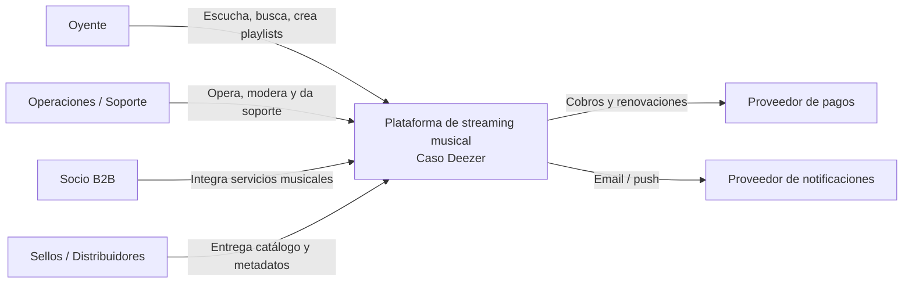

# C4 — Nivel 1: Diagrama de Contexto

> Modelo académico de referencia; no describe la arquitectura interna oficial de Deezer.

## Propósito

Mostrar las personas y sistemas externos que interactúan con la plataforma.

## Actores

### Oyente
Consume música, administra biblioteca, playlists, preferencias y suscripción.

### Operaciones / Soporte
Supervisa incidencias, catálogo, fraude, cuentas y operación.

### Socio B2B
Integra capacidades musicales mediante contratos/API.

### Sellos / Distribuidores
Entregan metadatos y contenido con licencias.

## Sistemas externos

### Proveedor de pagos
Procesa pagos, validaciones y renovaciones.

### Proveedor de notificaciones
Entrega mensajes push, email u otros canales.

## Responsabilidad del sistema

Ofrecer una experiencia musical personalizada, segura, escalable y disponible, asegurando búsqueda, catálogo, reproducción, biblioteca, recomendaciones y suscripciones.
