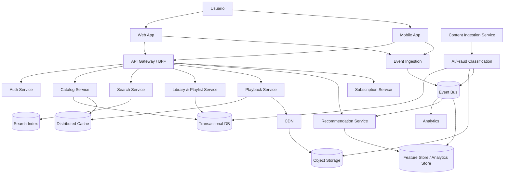

# C4 — Nivel 2: Diagrama de Contenedores

> Los contenedores y tecnologías son una propuesta académica.

## Contenedores principales

| Contenedor | Responsabilidad | Ejemplo tecnológico |
|---|---|---|
| Web App | Cliente web | React/Vue/Angular |
| Mobile App | Cliente móvil | Kotlin/Swift/Flutter |
| API Gateway/BFF | Entrada, routing, auth, rate limit | Gateway administrado / NGINX |
| Auth Service | Identidad y sesiones | OAuth 2.0 / OIDC |
| Catalog Service | Metadatos de música | Servicio stateless |
| Search Service | Consultas full-text | OpenSearch/Elasticsearch |
| Library & Playlist | Favoritos y playlists | Servicio + BD |
| Playback Service | Autorización y sesión de reproducción | Servicio stateless |
| Recommendation Service | Personalización | ML online/offline |
| Subscription Service | Planes, pagos y estados | Servicio transaccional |
| Content Ingestion | Entrada de catálogo/audio | Jobs + workflows |
| AI/Fraud Classification | Etiquetado y detección | Pipeline ML/reglas |
| Event Ingestion | Telemetría de interacción | Endpoint de alta escritura |
| Analytics | Métricas de negocio/producto | Procesamiento batch/stream |
| Event Bus | Comunicación asíncrona | Kafka/PubSub equivalente |
| Object Storage | Archivos de audio | S3/GCS equivalente |
| CDN | Distribución global | CDN global |

## Relaciones clave

1. El cliente usa el Gateway para operaciones de negocio.
2. El Playback Service no entrega el audio desde el backend: genera/autorización de acceso y el contenido se sirve por CDN.
3. Los eventos de escucha se publican de forma asíncrona.
4. El recomendador consume señales de comportamiento y mantiene un camino de fallback.
5. La ingestión de contenido se separa del camino crítico del usuario.
