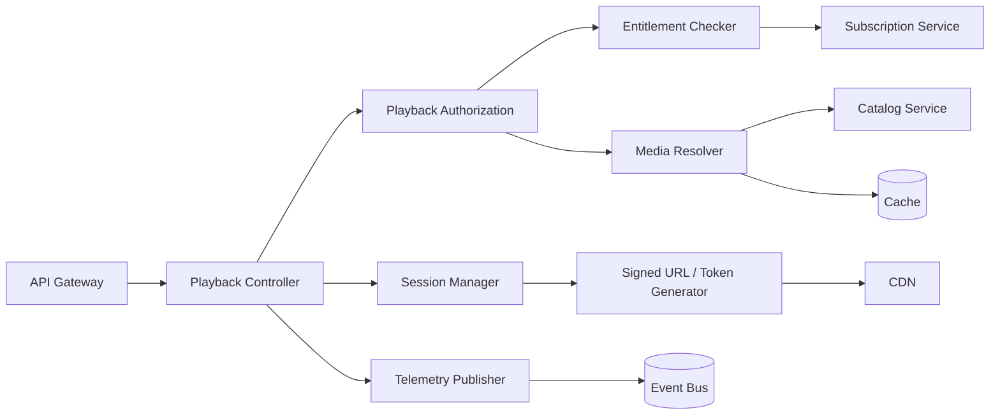

# C4 — Nivel 3: Componentes del Playback Service

Se selecciona **Playback Service** por ser un componente crítico para la experiencia.

## Componentes

### Playback Controller
Recibe la solicitud de reproducción y coordina el flujo.

### Playback Authorization
Valida que el usuario y contenido puedan reproducirse.

### Entitlement Checker
Verifica plan, región, estado de cuenta y restricciones aplicables.

### Media Resolver
Determina la variante/formato de audio y ubicación lógica del contenido.

### Session Manager
Crea una sesión efímera de reproducción y mantiene datos mínimos de contexto.

### Signed URL / Token Generator
Genera credenciales temporales para acceder al contenido mediante CDN.

### Telemetry Publisher
Publica eventos de inicio, pausa, finalización y errores sin bloquear el camino crítico.

## Flujo principal

1. Cliente solicita reproducción.
2. Se valida autenticación/autorización.
3. Se comprueba elegibilidad.
4. Se resuelve el recurso multimedia.
5. Se genera acceso temporal.
6. Cliente obtiene audio desde CDN.
7. Eventos de comportamiento se publican asíncronamente.

## Principios

- Mantener el servicio stateless siempre que sea posible.
- Evitar transferir audio a través del API Gateway.
- Cachear metadatos de alta frecuencia.
- Usar timeouts estrictos con dependencias.
- Aplicar fallback cuando telemetría o analítica fallen.
